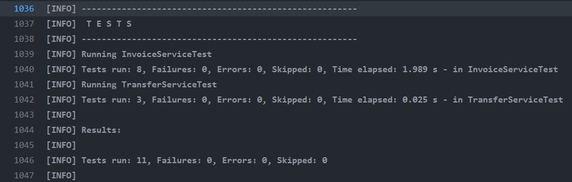
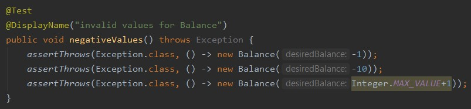
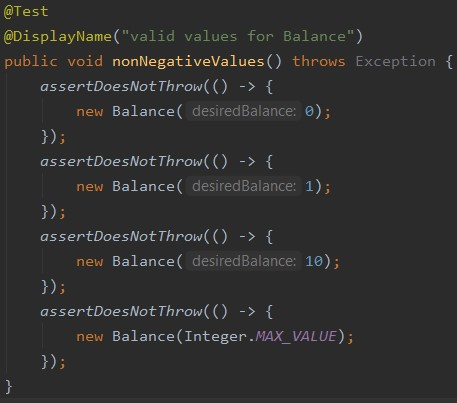
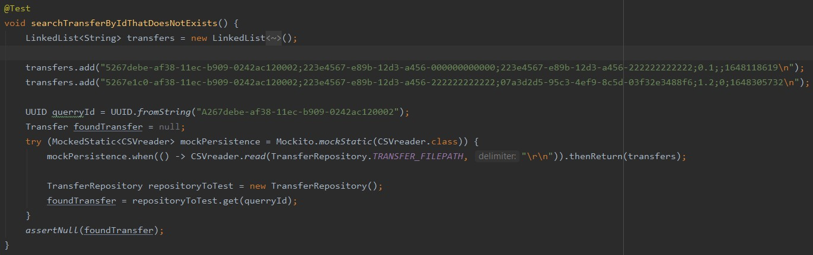

Kapitel 1: Einführung
-
<u><h3>Übersicht über die Applikation</u></h3>
Die Applikation abstrahiert den Geldfluss zwischen Nutzern.
Nutzer der Software können sich mit einem Nutzernamen registrieren und bekommen ein Hauptkonto erstellt.
Nutzer können auch Moneypools erstellen um Geld abseits ihres Hauptkontos für einen gewissen zweck zu sammeln.
Es wird kein Neues Geld generiert.
Wer Teilnehmen möchte müsste zu einer Zentralen Verwaltung der Software gehen und sein Echtes geld gegen Ledger-Dollar tauschen.
Auch das Auszahlen würde hypotetisch über diesen Weg funktionieren.
So können Geschäftsbeziehungen mit einem Prepaid Konto abgehandelt werden.

<u><h3>Wie startet man die Applikation?</u></h3>
[Wie startet man die Applikation? Welche Voraussetzungen werden benötigt? Schritt-für-SchrittAnleitung]

<u><h3>Wie testet man die Applikation?</u></h3>
Mit dem Command  mvn clean test können alle Tests mit einem einfachen Command ausgeführt werden.
Die Tests werden ebenso automatisch ausgeführt, wenn eine neue Pull-Request auf GitHub auf gemacht wird. Diese Ausführung funktioniert über GitHub Actions. Die Ausführung ist in einer yml-Datei definiert (/.github/workflows/build.yml)

Kapitel 2: Clean Architecture
-
<u><h3>Was ist Clean Architecture?</u></h3>
Bei der Clean Architecture geht es darum, den langlebigen Domänenkern und die Anwendungslogik von der potentiell sehr volatilen Außenwelt abzuschotten.
Man stellt sich die Anwendung als in Schichten geteilt vor. Umso weiter innen eine Klasse liegt, desto eher ist sie langlebig.
Code der bildlich gesprochen in einer inneren Schicht liegt hat keinen Zugriff auf die äußeren Schichten.
So kann sichergestellt werden, dass die genaue Implementation einer äußeren Schicht irrelevent für die inneren Schichten ist.
Lediglich die Schnittstellen müssen definiert und eingehalten werden.
Diese Zugriffskontrolle wird hier beispielsweise über dependencies geregelt.
Der Domänenkern weiß beispielsweise nicht einmal von der Existenz der Services oder des Repositories.
Daraus folgt auch, dass der innere Code unabhängig vom Rest der Anwendung ausgeführt werden.

<u><h3>Analyse der Dependency Rule</u></h3>
[https://moodle.dhbw.de/pluginfile.php/193721/mod_resource/content/1/clean-architecture.pdf]

Da wir die Ansätze von Clean Architecure verfolgen und es durch die Maven-Dependencies in den Packages enforced ist dürften keine Negativbeispiele existieren.
Keine Dependency geht von innen nach außen.

[(1 Klasse, die die Dependency Rule einhält und eine Klasse, die die Dependency Rule verletzt);
jeweils UML der Klasse und Analyse der Abhängigkeiten in beide Richtungen (d.h., von wem hängt die
Klasse ab und wer hängt von der Klasse ab) in Bezug auf die Dependency Rule]
###Positiv-Beispiel: Dependency Rule
###Negativ-Beispiel: Dependency Rule

<u><h3>Analyse der Schichten</u></h3>
- 3-Domainkern: ValueObjects  z.B. Depot (Klasse die ein Geldspeicher darstellt)
Diese Klasse ändern sich i.d.R. nicht. Sie ist Teil des Applikationskerns und ist unabhängig von jeglichen Speichermethodiken oder Anwendungsfällen.

- 0-Plugin-Database: CSVreader (Persistenzklasse, ließt die informationen von einer spezifischen Position mit CSV als spezifischen persistenzmethodik. Diese Technologien sollen ausgetauscht werden können, ohne den Domänenkern zu beeinflussen. Klassen in dieser Schicht veralten sehr schnell und oft. 

//TODO UML der Klasse (ggf. auch zusammenspielenden Klassen)

Kapitel 3: SOLID
-
[https://moodle.dhbw.de/pluginfile.php/199989/mod_resource/content/1/solid-slides.pdf]

<u><h3>Analyse Single-Responsibility-Principle (SRP)</u></h3>
[jeweils eine Klasse als positives und negatives Beispiel für SRP; jeweils UML der Klasse und
Beschreibung der Aufgabe bzw. der Aufgaben und möglicher Lösungsweg des Negativ-Beispiels (inkl.
UML)]
###Positiv-Beispiel
###Negativ-Beispiel

##Analyse Open-Closed-Principle (OCP)
[jeweils eine Klasse als positives und negatives Beispiel für OCP; jeweils UML der Klasse und
Analyse mit Begründung, warum das OCP erfüllt/nicht erfüllt wurde – falls erfüllt: warum hier
sinnvoll/welches Problem gab es? Falls nicht erfüllt: wie könnte man es lösen (inkl. UML)?]
###Positiv-Beispiel
###Negativ-Beispiel

<u><h3>Analyse Liskov-Substitution- (LSP), Interface-Segreggation- (ISP), Dependency-Inversion-Principle (DIP)</u></h3>
[jeweils eine Klasse als positives und negatives Beispiel für entweder LSP oder ISP oder DIP); jeweils
UML der Klasse und Begründung, warum man hier das Prinzip erfüllt/nicht erfüllt wird]
[Anm.: es darf nur ein Prinzip ausgewählt werden; es darf NICHT z.B. ein positives Beispiel für LSP
und ein negatives Beispiel für ISP genommen werden]
###Positiv-Beispiel
###Negativ-Beispiel

Kapitel 4: Weitere Prinzipien
-
<u><h3>Analyse GRASP: Geringe Kopplung</u></h3>
Hier sind die Action klassen zur steuerung der UI vermutlich zu nennen
[jeweils eine bis jetzt noch nicht behandelte Klasse als positives und negatives Beispiel geringer
Kopplung; jeweils UML Diagramm mit zusammenspielenden Klassen, Aufgabenbeschreibung und
Begründung für die Umsetzung der geringen Kopplung bzw. Beschreibung, wie die Kopplung aufgelöst
werden kann]
###Positiv-Beispiel
###Negativ-Beispiel

<u><h3>Analyse GRASP: Hohe Kohäsion</u></h3>
Hier ist wohl das UserAggregate zu nennen oder nach refactoring die Superclass vom UserRepository (sollte aufgeteilt werden in kleinere Repositories)
[eine Klasse als positives Beispiel hoher Kohäsion; UML Diagramm und Begründung, warum die
Kohäsion hoch ist]

<u><h3>Don’t Repeat Yourself (DRY)</u></h3>
- https://github.com/JanPfenning/AdvancedSoftwareEngineeringSplit/pull/9/commits/ea97cdf4c3a767f3b8f4980f5d360862081da47f
- https://github.com/JanPfenning/AdvancedSoftwareEngineeringSplit/commit/0114f198e3b6315d89391c50ba1f1bd282054429 (fix eines Tippfehlers)

Es ist relevant Geldsendungen nach Sendern und Empfängern zu filtern.
Die funktion einen Geldtransfer basierend auf einer ID zu lesen ist dabei in beiden Fällen gleich.
Lediglich die Position der zu überprüfenden ID ändert sich!
Die gemeinsame Funktionalität des Suchens nach einer ID kann demnach ausgelagwert werden.

Kapitel 5: Unit Tests
-
<u><h3>10 Unit Tests</h3></u>

Unit Test           |Beschreibung
-----               |----
| senderInsufficientMoney@TransferserviceTest | Überprüft, dass nur Geld von gedeckten Accounts gesendet werden kann| 
| AccountToAccountHappyPath@TransferserviceTest | Überprüft, dass Geld beim Sender abgebucht wurde und der Empfänger es auch rechtmäßig erhalten hat |
| AccountToMoneypoolHappyPath@TransferserviceTest | Überprüft, dass auch Moneypools Geld von Accounts erhalten können  |
| MoneypoolToAccount@TransferserviceTest | Überprüft, dass es nicht möglich ist, Moneypools zu verwenden um Geld zu versenden |
| SendInvoiceHappyPathAccount@InvoiceServiceTest | Testet das Erstellen von Rechnungen, die auf einen Account bezahlt werden sollen |
| SendInvoiceHappyPathMoneypool@InvoiceServiceTest | Testet das Erstellen von Rechnungen die auf einen Moneypool bezahlt werden sollen |
| InvoiceToUnknownUser@InvoiceServiceTest | Überprüft, dass nur Rechnungen an Nutzer gestellt werden, die auch in der Anwendung registriert sind |
| negativeInvoice@TransferServiceTest | Überprüft, dass Nutzer keine Negativen Geldbeträge in Rechnung stellen |
| PayInvoiceHappy@TransferService | Testet das Bezahlen einer Rechnung von einem Gedeckten Account |
| searchTransferByIdThatDoesNotExists@TransferRepositoryTest | Überprüft, dass kein Transfer zurück gefunden wird, wenn die ID der Suche nicht existiert |

<u><h3>ATRIP: Automatic</h3></u>

Mit dem Command  mvn clean test können alle Tests mit einem einfachen Command ausgeführt werden.
Die Tests werden ebenso automatisch ausgeführt, wenn eine neue Pull-Request auf GitHub auf gemacht wird. Diese ausführung funktioniert über GitHub Actions. Die Ausführung ist in einer yml-Datei definiert (/.github/workflows/build.yml)

Wie im Screenshot zu sehen, kann ein Test, sofern er läuft, lediglich erfolgreich durchlaufen oder fehlschlagen. Sind nicht ausnahmslos alle Tests erfolgreich, wird die Pullrequest gesperrt.

Diese Automatisierung und Einfachheit der Testausführung ist sehr wichtig, da das händische Testen sehr nervig, anstrengend und auch Zeitaufwendig ist.
Die Automatisierung ist auch hilfreich um eine einheitliche abfolge der Schritte einfacher realisieren zu können. Die Tests erfordern zB keine manuellen Eingaben, diese sind im Test Hardcoded. 

Die Tests werden Schicht für Schicht durchlaufen und die Resultate einzeln je Schicht aufgeführt.

<u><h3>ATRIP: Thorough</h3></u>

Es gibt Ansätze, die Test-Before-Code prädigen. Hierbei wird sich vorher über die Funktionalität der Funktion Gedanken gemacht. Auf der anderen Seite kann ein Test im nachhinein zur Überprüfung der Integrität geschrieben werden.

Die Tests sollten alles <b>notwendige</b> und <b>kritische</b> abdecken. Die Auslegung dessen liegt im ermessen des Entwicklers.

Das Testen von Gettern ist i.d.R. überflüssig, da sie nur einen privaten Wert zum auslesen bereitstellen um so zu verhindern dass das Attribut als public Attribut zugänglich und veränderbar ist.

Das Testen von Konstruktoren ist nach einigen Entwicklern auch überflüssig.
Diese enthalten jedoch teilweise validierungslogik. Diese zu Testen dient dazu, beim automatischen Testen ungewollte Seiteneffekte zu finden, bevor sich diese fortplanzen. 

Diese Tests decken alle sinnvollen Fälle ab, eine Accountbalance zu erstellen. Diese sollte nie negativ sein, aber darf genau 0 sein.

Der Test searchTransferByIdThatDoesNotExist wurde aufgrund eines gefundenen Bugs erstellt um zukünftig Bugs wegen des selben Fehlers zu vermeiden. Wenn die ID nicht existiert, dann soll kein Mockobjekt oder eine Leere Liste o.Ä. zurückgegeben werden.

Unvollständig ist natürlich das fehlen von Tests für das User-Repository.

<u><h3>ATRIP: Professional</h3></u>

[jeweils 1 positives und negatives Beispiel zu ‘Professional’; jeweils Code-Beispiel, Analyse und
Begründung, was professionell/nicht professionell ist]

##Code Coverage
Die CodeCoverage ist mittels SonarCloud, GitHubActions und JUnit getestet.
Die Testergebnisse werden von JUnit gesammelt und der Report and SonarCloud gesendet.
https://sonarcloud.io/summary/overall?id=JanPfenning_AdvancedSoftwareEngineeringSplit
https://sonarcloud.io/component_measures?id=JanPfenning_AdvancedSoftwareEngineeringSplit&metric=coverage&view=list
[Code Coverage im Projekt analysieren und begründen]

##Fakes und Mocks
[Analyse und Begründung des Einsatzes von 2 Fake/Mock-Objekten; zusätzlich jeweils UML
Diagramm der Klasse]

Kapitel 6: Domain Driven Design
-
##Ubiquitous Language
[4 Beispiele für die Ubiquitous Language; jeweils Bezeichung, Bedeutung und kurze Begründung,
warum es zur Ubiquitous Language gehört]
| Bezeichnung | Bedeutung | Begründung |
|-|-|-|
| Depot | Zusammenfassung aller möglichen Geldspeicher | Accounts und Moneypools sind beides Geldspeicher sind aber für unterschiedliche Dinge gedacht |
| Transfer | Überweisung jeglicher Art | Auch Payments sind überweisungen aber diejendigen, die eine Invoice bezahlen |
| Invoice | Rechnung | Nutzer können Rechnungen ausstellen, die sich andere Nutzer anscheun können und bezahlen können
| Ledger | Gesamtmenge aller Transfers die getätigt wurden | Der nutzer kann diesen Ledger analysieren und nach empfangenem und gesendetem Geld suchen

<u><h3>Entities</u></h3>
Entities sind ähnlich zu Value Objects, sind jedoch anhand einer Art ID und nicht innerer Werte identifiziert.
Modifikationen an einer Entity sollen diese nie aus einem Validen status entfernen.
Account, User, Moneypool, Transfer, Payment, ...
[UML, Beschreibung und Begründung des Einsatzes einer Entity; falls keine Entity vorhanden:
ausführliche Begründung, warum es keines geben kann/hier nicht sinnvoll ist]

<u><h3>Value Objects</u></h3>
Valueobjects sind definierte Datentypen, die nach Möglichkeit primitiven Datentypen ersetzen sollen.
Value Objects sollen im Konstruktor bereits die Regeln der Domäne validieren und so nur in einem Validen Zustand existieren.
[UML, Beschreibung und Begründung des Einsatzes eines Value Objects; falls kein Value Object
vorhanden: ausführliche Begründung, warum es keines geben kann/hier nicht sinnvoll ist]

<u><h3>Repositories</u></h3>
Transfer, Invoice, User
[UML, Beschreibung und Begründung des Einsatzes eines Repositories; falls kein Repository
vorhanden: ausführliche Begründung, warum es keines geben kann/hier nicht sinnvoll ist]

<u><h3>Aggregates</u></h3>
Account, User, Moneypool, mit User als RootEntity
[UML, Beschreibung und Begründung des Einsatzes eines Aggregates; falls kein Aggregate vorhanden:
ausführliche Begründung, warum es keines geben kann/hier nicht sinnvoll ist]

Kapitel 7: Refactoring
-
<u><h3>Code Smells</u></h3>
[jeweils 1 Code-Beispiel zu 2 Code Smells aus der Vorlesung; jeweils Code-Beispiel und einen
möglichen Lösungsweg bzw. den genommen Lösungsweg beschreiben (inkl. (Pseudo-)Code)]

<u><h3>2 Refactorings</u></h3>
- Long Class extracted into subclasses
https://github.com/JanPfenning/AdvancedSoftwareEngineeringSplit/pull/32/files
Im UserRepository war der Code dafür direkt Accounts und Moneypools auszulesen.
Diese Entitäten haben nun jeweils eigene Repositories die vom User Repository aufgerufen werden. 

TODO: UML

- extract method
https://github.com/JanPfenning/AdvancedSoftwareEngineeringSplit/commit/b49d5f087ee3ae59a97852e9bc90eafddc4b770c
Es war nicht deutlich was "rowdata[0]" bedeuten sollte. 
Darum die benannte funktion die nun verdeutlicht, dass es sich um den Nutzernamen handelt

TODO: UML With and without the function?

Kapitel 8: Entwurfsmuster
-
[2 unterschiedliche Entwurfsmuster aus der Vorlesung (oder nach Absprache auch andere) jeweils
sinnvoll einsetzen, begründen und UML-Diagramm]