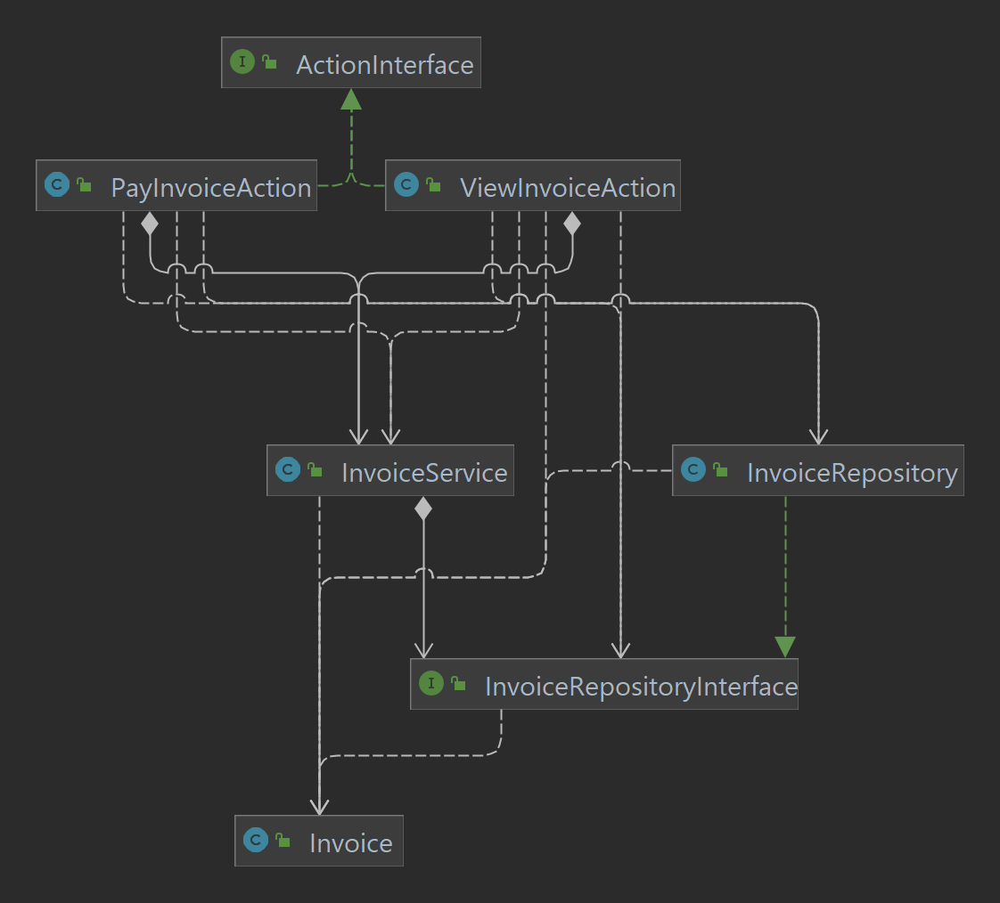
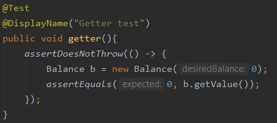
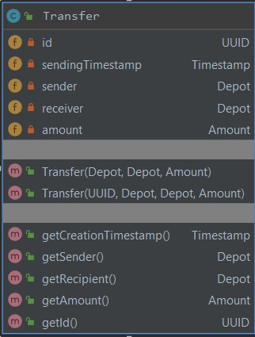
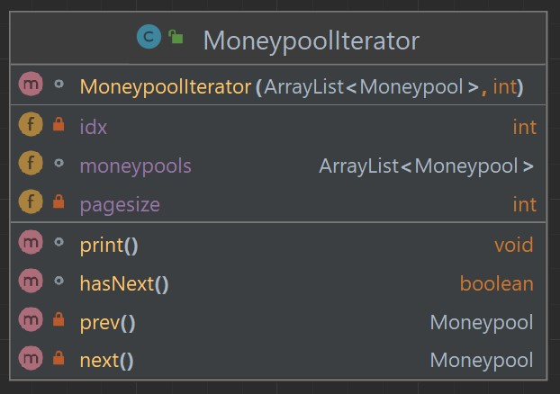

Kapitel 1: Einführung
-
<u><h3>Übersicht über die Applikation</u></h3>
Die Applikation abstrahiert den Geldfluss zwischen Nutzern.
Nutzer der Software können sich mit einem Nutzernamen registrieren und bekommen ein Hauptkonto erstellt.
Nutzer können auch Moneypools erstellen um Geld abseits ihres Hauptkontos für einen gewissen zweck zu sammeln.
Es wird kein Neues Geld generiert.
Wer Teilnehmen möchte müsste zu einer Zentralen Verwaltung der Software gehen und sein Echtes geld gegen Ledger-Dollar tauschen.
Auch das Auszahlen würde hypotetisch über diesen Weg funktionieren.
So können Geschäftsbeziehungen mit einem Prepaid Konto abgehandelt werden.

<u><h3>Wie startet man die Applikation?</u></h3>
[Wie startet man die Applikation? Welche Voraussetzungen werden benötigt? Schritt-für-SchrittAnleitung]

<u><h3>Wie testet man die Applikation?</u></h3>
Mit dem Command  mvn clean test können alle Tests mit einem einfachen Command ausgeführt werden.
Die Tests werden ebenso automatisch ausgeführt, wenn eine neue Pull-Request auf GitHub auf gemacht wird. Diese Ausführung funktioniert über GitHub Actions. Die Ausführung ist in einer yml-Datei definiert (/.github/workflows/build.yml)

Kapitel 2: Clean Architecture
-
<u><h3>Was ist Clean Architecture?</u></h3>
Bei der Clean Architecture geht es darum, den langlebigen Domänenkern und die Anwendungslogik von der potentiell sehr volatilen Außenwelt abzuschotten.
Man stellt sich die Anwendung als in Schichten geteilt vor. Umso weiter innen eine Klasse liegt, desto eher ist sie langlebig.
Code der bildlich gesprochen in einer inneren Schicht liegt hat keinen Zugriff auf die äußeren Schichten.
So kann sichergestellt werden, dass die genaue Implementation einer äußeren Schicht irrelevent für die inneren Schichten ist.
Lediglich die Schnittstellen müssen definiert und eingehalten werden.
Diese Zugriffskontrolle wird hier beispielsweise über dependencies geregelt.
Der Domänenkern weiß beispielsweise nicht einmal von der Existenz der Services oder des Repositories.
Daraus folgt auch, dass der innere Code unabhängig vom Rest der Anwendung ausgeführt werden.

<u><h3>Analyse der Dependency Rule</u></h3>
[https://moodle.dhbw.de/pluginfile.php/193721/mod_resource/content/1/clean-architecture.pdf]

[(1 Klasse, die die Dependency Rule einhält und eine Klasse, die die Dependency Rule verletzt);
jeweils UML der Klasse und Analyse der Abhängigkeiten in beide Richtungen (d.h., von wem hängt die
Klasse ab und wer hängt von der Klasse ab) in Bezug auf die Dependency Rule]
<h4>Positiv-Beispiel: Dependency Rule</h4>
Die Domain-Klasse UserRepository greift auf keine Klassen außerhalb von Layer 3 zu.

Alle schichtübergreifenden Abhängigkeiten greifen von einer äußeren Schicht auf die innere Schicht zu bzw. von einer kleineren Schicht auf die größere Schicht zu.

<h4>Negativ-Beispiel: Dependency Rule</h4>
Da wir die Ansätze von Clean Architecure verfolgen und es durch die Maven-Dependencies in den Packages enforced ist dürften keine Negativbeispiele existieren.
Keine Dependency geht von innen nach außen.

<u><h3>Analyse der Schichten</u></h3>
- 3-Domainkern: ValueObjects  z.B. Depot (Klasse die ein Geldspeicher darstellt)
Diese Klasse ändern sich i.d.R. nicht. Sie ist Teil des Applikationskerns und ist unabhängig von jeglichen Speichermethodiken oder Anwendungsfällen.

- 0-Plugin-Database: CSVreader (Persistenzklasse, ließt die informationen von einer spezifischen Position mit CSV als spezifischen persistenzmethodik. Diese Technologien sollen ausgetauscht werden können, ohne den Domänenkern zu beeinflussen. Klassen in dieser Schicht veralten sehr schnell und oft. 

//TODO UML der Klasse (ggf. auch zusammenspielenden Klassen)

Kapitel 3: SOLID
-
[https://moodle.dhbw.de/pluginfile.php/199989/mod_resource/content/1/solid-slides.pdf]

<u><h3>Analyse Single-Responsibility-Principle (SRP)</u></h3>
[jeweils eine Klasse als positives und negatives Beispiel für SRP; jeweils UML der Klasse und
Beschreibung der Aufgabe bzw. der Aufgaben und möglicher Lösungsweg des Negativ-Beispiels (inkl.
UML)]
Das Single-Resopnsibility-Principle (SRP) ist ein Prinzip, das besagt, dass eine Klass (kann auch feiner granuliert werden) nur eine Aufgabe erfüllen sollt.
<h4>Positiv-Beispiel</h4>
Ein positives Beispiel ist die Unterteilung in CSVreader und CSVwriter, dabei beide Klassen für unterschiedliche IO-Operationen zuständig sind. Zudem muss wenn das Parsening des CSVreaders angepasst wird, nicht die CSVwriter angepasst werden.

<h4>Negativ-Beispiel</h4>
An TransferService ist ein negatives Beispiel für Single-Responsibility-Principle, da es zwei Aufgaben gibt, die von einer Klasse aus ausgeführt werden müssen.
Einmal das senden von Geld (sendMoney()) und das analysieren von Transaktionen (analyseTransferSendings() und analyseTransferRecievings())).

Dies kann durch die Teilung des TransferService in zwei Klassen (TransferSendService und TransferAnalyseService) erreicht werden.

Dadruch wird das SRP auch für die Klassen TransferSendService und TransferAnalyseService erfüllt.

<u><h3>Analyse Open-Closed-Principle (OCP)</u></h3>
[jeweils eine Klasse als positives und negatives Beispiel für OCP; jeweils UML der Klasse und
Analyse mit Begründung, warum das OCP erfüllt/nicht erfüllt wurde – falls erfüllt: warum hier
sinnvoll/welches Problem gab es? Falls nicht erfüllt: wie könnte man es lösen (inkl. UML)?]
<h4>Positiv-Beispiel</h4>
Ein positives Beispiel für ein Open-Closed-Principle ist die Actions-Verwaltung. Ihre Aufgabe ist es die verschiedenen Nutzereingaben zu unterscheiden und entsprechend zu reagieren. 
Dafür wird in InitAction eine Hashmap erstellt, welche Integer (User-Input) auf ActionInterfaces mapped.
Wenn eine neue Action (Funktion für den Nutzer) entwickelt wird so muss nicht innerhalb der Klasse ActionInterfaces eine neue Funktion erstellt / modifiziert werden, sondern nur möglicherweise die Hashmap ergänzt und eine neue Klasse erstellt werden, welche ActionInterface implementiert. Somit sind Erweiterungen der Funktionalität sehr einfach, wobei Modifikationen bestehendes Codes vermieden werden.

<h4>Negativ-Beispiel</h4>

Ein negativ Beispiel für das Open-Closed-Principle sind die Services. Hier wir dies am Beispiel von InvoiceService gezeigt.

Man kann erkennen, dass die Actions (hier: PayInvoice und ViewInvoice) direkt den InvoiceService instanzieren.

Da kein Interface benutzt wird, müssen bei Änderungen an Services, diese Änderungen an den Actions mit angepasst werden.
Die Klassen (Actions) sind somit abhängig von der konkreten Implementierung des Services.

Um dies zu lösen, wird ein ServiceInterface (hier: InvoiceServiceInterface) erstellt. 
Dieses Interface definiert die Schnittstellen für die Actions und entkoppelt die Actions von der Implementierung des Services.

Die Schnittstellen sind für Änderungen geschlossen (da die Schnittstellendefinition eingehalten werden muss), aber können leicht erweitert werden (innerhalb der implementation sind zusätzliche Hilfsfunktionen erlaubt; Außerdem kann ein Interface vererbt werden um so auch die Erweiterungen an der Schnittstellendefinition zu ermöglichen). Der Hauptvorteil dieses Ansatzes ist, dass eine Schnittstelle eine zusätzliche Abstraktionsebene einführt, die eine lose Kopplung ermöglicht. Die potentiell verschiedenen Implementationen einer Schnittstelle sind unabhängig voneinander und müssen sich keinen Code teilen.
Damit wird das Open-Closed-Principle erfüllt.

<u><h3>Analyse Liskov-Substitution- (LSP), Interface-Segreggation- (ISP), Dependency-Inversion-Principle (DIP)</u></h3>
[jeweils eine Klasse als positives und negatives Beispiel für entweder LSP oder ISP oder DIP); jeweils
UML der Klasse und Begründung, warum man hier das Prinzip erfüllt/nicht erfüllt wird]
[Anm.: es darf nur ein Prinzip ausgewählt werden; es darf NICHT z.B. ein positives Beispiel für LSP
und ein negatives Beispiel für ISP genommen werden]
Das Liskov-Substitution-Principle (LSP) besagt, dass Obejkte einer Klasse, welche von einer anderen Klasse abgeleitet werden, durch Objekte dieser (Super-)Klasse ersetzt werden können.
Dabei haben Objekte der abgeleiteten Klassen mindestens die gleichen Mehtoden wie Objekte der Superklasse. Zwei Klassen ähnlicher aber nicht identischer Funktionalität können durch ein Interface oder eine Superkalsse abstrahiert werden.
<h4>Positiv-Beispiel</h4>
Ein positives Beispiel für ein Liskov-Substitution-Principle ist die Superklasse Depot. Von ihr Erben die Klassen Account und Moneypool.
Dabei unterscheiden sich die Klassen darin, dass kein Geld aus einem Moeneypool transferiert werden kann. 
Beide Klassen lassen sich somit generalisieren / abstahieren als Depots. Wenn die Unterscheidung im Kontext irrelevant ist kann somit ein Objekt von Depot erstellt werden.
Dies kann innerhalb des TransferRepositorys gesehen werden.

Es wurde kein negativ Beispiel für das Litkov-Substitution-Principle gefunden.

Kapitel 4: Weitere Prinzipien
-
<u><h3>Analyse GRASP: Geringe Kopplung</u></h3>
Hier sind die Action klassen zur steuerung der UI vermutlich zu nennen

<h4>Positiv-Beispiel</h4>

Alle Verbindungen mit der Implementation des InvoiceRepositoryInterface sind reine Erstellungen. Zugriffe auf die Funktionalität laufen einzig über das Interface. Die Kopplung ist hierbei also sehr gering. Die Implementation kann sich Ändern, ohne dass man befürchten muss, dass sich das Verhalten bei der nutzung des Interfaces ändert.

InvoiceRepository wird erstellt und als InvoiceRepositoryInterface deklariert. Aufrufer kennen somit nur das Interface.

das folgende Bild zeigt gut, wie die Komplexität der Interfaces quasi nonexistent ist.

Auf der anderen Seite ist die Implementation des Interfaces sehr komplex.

<h4>Negativ-Beispiel</h4>

Im folgenden Beispiel wurde keine Schnittstelle zwischen den Repositories und der Kommunikation mit dem Dateisystem CSVreader und CSVwriter vereinbart.

Die Repositories greifen direkt auf die Implementierung zu. Hier sind die Abhängigkeiten also zu Klassen mit hoher komplexität. Der CSVreader hat keinen <it>Contract</it> an den es sich halten muss. Änderungen können so unerwartete Folgen und Transitive abhängigkeiten haben.

Mit einem Interface als Schnittstelle könnte die Kopplung deutlich reduziert werden.

<u><h3>Analyse GRASP: Hohe Kohäsion</u></h3>
Hier ist wohl das UserAggregate zu nennen oder nach refactoring die Superclass vom UserRepository (sollte aufgeteilt werden in kleinere Repositories)
[eine Klasse als positives Beispiel hoher Kohäsion; UML Diagramm und Begründung, warum die
Kohäsion hoch ist]

<u><h3>Don’t Repeat Yourself (DRY)</u></h3>
- https://github.com/JanPfenning/AdvancedSoftwareEngineeringSplit/pull/9/commits/ea97cdf4c3a767f3b8f4980f5d360862081da47f
- https://github.com/JanPfenning/AdvancedSoftwareEngineeringSplit/commit/0114f198e3b6315d89391c50ba1f1bd282054429 (fix eines Tippfehlers)

Es ist relevant Geldsendungen nach Sendern und Empfängern zu filtern.
Die funktion einen Geldtransfer basierend auf einer ID zu lesen ist dabei in beiden Fällen gleich.
Lediglich die Position der zu überprüfenden ID ändert sich!
Die gemeinsame Funktionalität des Suchens nach einer ID kann demnach ausgelagwert werden.

Kapitel 5: Unit Tests
-
<u><h3>10 Unit Tests</h3></u>

Unit Test           |Beschreibung
-----               |----
| senderInsufficientMoney@TransferserviceTest | Überprüft, dass nur Geld von gedeckten Accounts gesendet werden kann| 
| AccountToAccountHappyPath@TransferserviceTest | Überprüft, dass Geld beim Sender abgebucht wurde und der Empfänger es auch rechtmäßig erhalten hat |
| AccountToMoneypoolHappyPath@TransferserviceTest | Überprüft, dass auch Moneypools Geld von Accounts erhalten können  |
| invoiceAlreadyPaid@InvoiceServiceTest | Überprüft, dass eine Rechnung nicht mehrfach bezahlt wird |
| SendInvoiceHappyPathAccount@InvoiceServiceTest | Testet das Erstellen von Rechnungen, die auf einen Account bezahlt werden sollen |
| SendInvoiceHappyPathMoneypool@InvoiceServiceTest | Testet das Erstellen von Rechnungen die auf einen Moneypool bezahlt werden sollen |
| InvoiceToUnknownUser@InvoiceServiceTest | Überprüft, dass nur Rechnungen an Nutzer gestellt werden, die auch in der Anwendung registriert sind |
| negativeInvoice@InvoiceServiceTest | Überprüft, dass Nutzer keine Negativen Geldbeträge in Rechnung stellen |
| PayInvoiceHappy@InvoiceServiceTest | Testet das Bezahlen einer Rechnung von einem Gedeckten Account |
| searchTransferByIdThatDoesNotExists@TransferRepositoryTest | Überprüft, dass kein Transfer zurück gefunden wird, wenn die ID der Suche nicht existiert |

<u><h3>ATRIP: Automatic</h3></u>

Mit dem Command  mvn clean test können alle Tests mit einem einfachen Command ausgeführt werden.
Die Tests werden ebenso automatisch ausgeführt, wenn eine neue Pull-Request auf GitHub auf gemacht wird. Diese ausführung funktioniert über GitHub Actions. Die Ausführung ist in einer yml-Datei definiert (/.github/workflows/build.yml)

Wie im Screenshot zu sehen, kann ein Test, sofern er läuft, lediglich erfolgreich durchlaufen oder fehlschlagen. Sind nicht ausnahmslos alle Tests erfolgreich, wird die Pullrequest gesperrt.

Diese Automatisierung und Einfachheit der Testausführung ist sehr wichtig, da das händische Testen sehr nervig, anstrengend und auch Zeitaufwendig ist.
Die Automatisierung ist auch hilfreich um eine einheitliche abfolge der Schritte einfacher realisieren zu können. Die Tests erfordern zB keine manuellen Eingaben, diese sind im Test Hardcoded. 

Die Tests werden Schicht für Schicht durchlaufen und die Resultate einzeln je Schicht aufgeführt.

<u><h3>ATRIP: Thorough</h3></u>

Es gibt Ansätze, die Test-Before-Code prädigen. Hierbei wird sich vorher über die Funktionalität der Funktion Gedanken gemacht. Auf der anderen Seite kann ein Test im nachhinein zur Überprüfung der Integrität geschrieben werden.

Die Tests sollten alles <b>notwendige</b> und <b>kritische</b> abdecken. Die Auslegung dessen liegt im ermessen des Entwicklers.

Das Testen von Gettern ist i.d.R. überflüssig, da sie nur einen privaten Wert zum auslesen bereitstellen um so zu verhindern dass das Attribut als public Attribut zugänglich und veränderbar ist.

Das Testen von Konstruktoren ist nach einigen Entwicklern auch überflüssig.
Diese enthalten jedoch teilweise validierungslogik. Diese zu Testen dient dazu, beim automatischen Testen ungewollte Seiteneffekte zu finden, bevor sich diese fortplanzen. 

Diese Tests decken alle sinnvollen Fälle ab, eine Accountbalance zu erstellen. Diese sollte nie negativ sein, aber darf genau 0 sein.

Der Test searchTransferByIdThatDoesNotExist wurde aufgrund eines gefundenen Bugs erstellt um zukünftig Bugs wegen des selben Fehlers zu vermeiden. Wenn die ID nicht existiert, dann soll kein Mockobjekt oder eine Leere Liste o.Ä. zurückgegeben werden.

Unvollständig ist natürlich das fehlen von Tests für das User-Repository.

<u><h3>ATRIP: Professional</h3></u>

Im folgenden Beispiel sieht man, wie der Testcode den gleichen Standards wie der Produktivcode folgt. Ein Test umfasst nur rund 15 Zeilen, ist nicht tief verschachtelt und hat durchaus sprechende Variablennamen.

Die folgenden vier Zeilen sind jedoch in verschiedenen Tests in der Klasse TransferServiceTest zu finden. 

Diese sollten, wie im produktivcode auch an einer gemeinsamen Stelle verwaltet werden. Hier wird eindeutig das Prinzip Dont-Repeat-Yourself verletzt. Außerdem fällt auf, dass die Zeilen vergleichsweise lang sind - was jedoch den Variablen und Funktionsnamen geschuldet ist.

<u><h3>Code Coverage</u></h3>
Die CodeCoverage ist mittels SonarCloud, GitHubActions und JUnit getestet.
Die Testergebnisse werden von JUnit gesammelt und der Report and SonarCloud gesendet.
- https://sonarcloud.io/summary/overall?id=JanPfenning_AdvancedSoftwareEngineeringSplit
- https://sonarcloud.io/component_measures?id=JanPfenning_AdvancedSoftwareEngineeringSplit&metric=coverage&view=list

Die Coverage alleine ist noch nicht wirklich aussagekräftig. Wie zuvor beschrieben müssen z.B. Getter oder Teilweise Konstruktoren nicht getestet werden. Eine Codecoverage von 1/5 wäre für große und kritische Systeme jedoch ungeachtet dessen deutlich zu wenig. Einige unserer Klassen sind gar nicht vertestet, daher ist es zu erwarten dass sich die Codecoverage in Grenzen hält. 

<u><h3>Fakes und Mocks</u></h3>

InvoiceService hat u.A. Abhängigkeiten zu Depot, der Implementierung von InvoiceRepositoryInterface und Invoice. Diese haben potentiell selbst noch weitere Abhängigkeiten, welche Transitiv gegeben sein müssten.

Da aber nur die Funktionalität dieser einen Klasse getestet werden soll, werden sog. Mock-Objekte angelegt. Diese geben für eine gewisse eingabe einfach eine gewünschte Ausgabe, die das verhalten dieses Objekts imitieren soll.

<!---->
<h4>Beispiel 1 - Depot Mock als Account</h4>

Das Mock-Objekt mockedPlayerDepot ist also wie eine Instanz vom Typ Account zu behandeln. Egal wie die Funktionalität in der Klasse Account jetzt implementiert ist, wenn auf dem Mock-Objekt getBalance() aufgerufen wird, wird ein Kontostand von 100 zurückgegeben. So kann dieser Zustand forciert werden ohne lange vorbereitungen.
Die Mock-Objekte abstrahieren also die Objekte mit denen die zu testende Klasse in der Realität zutun haben wird, indem sie die gleichen Funktionen anbietet wie das Original, aber nur so tut als würde sie die Werte echt berechnen und stattdessen einen fixen Wert zurückliefert.

Die gemockten Objekte können so einfach als Platzhalter für die originalen Objekte fungieren.

Die Mock-Objekte werden durch das "Inlining" von JUnit sogar noch wesentlich kompakter. Hier kann eine Funktion in einer Zeile definiert werden. Auf die deklarierung der Resultate unwichtiger Funktionen kann so verzichtet werden. Außerdem sind die zurückzugebenden Werte der Mock-Objekte für die meisten Test-Cases sehr unterschiedlich und müssen deswegen sowieso neu definiert werden. 

<h4>Beispiel 2 - Invoice Mock</h4>

Die UML-Diagramme der entstehenden Mock-Objekte unterscheiden sich nicht von den Diagrammen der Objekte die sie immitieren, da beide Objekte von der gleichen Klasse ausgehen. Lediglich die implementation der Methoden ändert sich (oder einige Methoden sind potentiell im Mock-Objekt nicht implementiert). Lediglich private Funktionen würden einen Unterschied im UML-Diagramm ausmachen, diese sind auf dem Mock-Objekt i.d.R. überflüssig.

Kapitel 6: Domain Driven Design
-
<u><h3>Ubiquitous Language</u></h3>
[4 Beispiele für die Ubiquitous Language; jeweils Bezeichung, Bedeutung und kurze Begründung,
warum es zur Ubiquitous Language gehört]
| Bezeichnung | Bedeutung | Begründung |
|-|-|-|
| Depot | Zusammenfassung aller möglichen Geldspeicher | Accounts und Moneypools sind beides Geldspeicher sind aber für unterschiedliche Dinge gedacht |
| Balance | Kontostand | Balances beschreiben Geldmengen im Bezug auf ein Depot. Da Depots aber nicht ins negative gehen dürfen wird hier zu "Amount" unterschieden |
| Invoice | Rechnung | Nutzer können Rechnungen ausstellen, die sich andere Nutzer anscheun können und bezahlen können
| Ledger | Gesamtmenge aller Transfers die getätigt wurden | Der nutzer kann diesen Ledger analysieren und nach empfangenem und gesendetem Geld suchen

<u><h3>Entities</u></h3>
Entities sind ähnlich zu Value Objects, sind jedoch anhand einer Art ID und nicht innerer Werte identifiziert.
Modifikationen an einer Entity sollen diese nie aus einem Validen status entfernen.
Account, User, Moneypool, Transfer, Payment, ...

Ein Transfer wird ausschließlich andhand von seiner ID auf gleichheit überprüft. Eine exakte Kopie des Transfers mit einer anderen ID sind zwei unterschiedliche Objekte (wie bei zwei Schülern mit dem gleichen Namen). 

<u><h3>Value Objects</u></h3>
Valueobjects sind definierte Datentypen, die nach Möglichkeit primitiven Datentypen ersetzen sollen.
Value Objects sollen im Konstruktor bereits die Regeln der Domäne validieren und so nur in einem Validen Zustand existieren.

Das Value Object Money definiert Geld als Datentyp. Würde hier kein value object eingesetzt werden, würde Geld einfach als float dargestellt werden. floats sind aber potentiell negativ. In dieser Domäne gibt es jedoch keine negativen Geldsummen. Das Valueobject definiert Berechungsfunktionen die wiederum wieder neue Valueobjects zurückliefern. Die Klasse ist final und alle Attribute sind "blank final" können also nur ein einziges mal im Konstruktor gesetzt werden. Equals und Hashcode sind überschrieben, um sicherzustellen, dass zwei instanzen eines Value Objects bei gleichem Value auch gleich angesehen werden. Es gibt keine Settermethoden, der einzige weg ein Valueobjekt zu bekommen ist die Instanziierung. Innerhalb der Konstruktormethode wird auch jegliche Logik validiert. Ein Valueobjekt kann also nur valide existieren und diesen validen Zustand nie verlassen.

<u><h3>Repositories</u></h3>
Repositories haben die Aufgabe, Objekte hinzuzufügen, Objekte nach Bezeichnern oder komplexen Kriterien abzurufen und Objekte zu entfernen. Es gibt auch Anwendungsfälle, die Aggregationen erfordern, wie z. B. die Anzahl der Objekte im System oder die Gesamtmenge aller Produkte im Lager. Für diese Anwendungsfälle kann das Repository direkte Aggregationsmethoden bereitstellen, so dass wir nicht ineffizient viele Objekte abrufen müssen.

Das Repository Invoice kann Rechnungen basierend auf der ID lesen, alle Rechungen zu einem Nutzernamen auslesen und eine Rechnung persistieren.
Die Methoden sind im dazugehörtigen Interface deklariert.

<u><h3>Aggregates</u></h3>
Ein Aggregat ist eine Ansammlung von Domänenobjekten, die als eine Einheit behandelt werden können. Eine Entität innerhalb des Aggregates fungiert als die Aggregate-Root bzw. der Root-Entity. Über diese wird auf das gesamte Aggregat zugegriffen.

Die Abbildung zeigt im oberen Bereich das eigentliche Aggregat "UserAggregate" welches die Entitäten User, Account und Moneypool vereint.
Das Aggregat "besteht aus" Account und Moneypool.
Das UserRepositoryInterface ist die einzige schnittstelle zum Moneypool und Account Repository. Ein zugriff auf eine Sub-Entität muss also über das Aggregate Root verlaufen.
Das UserRepository ruft dann intern die Repositories der Sub-Entitäten auf.

Kapitel 7: Refactoring
-
<u><h3>Code Smells</u></h3>
[jeweils 1 Code-Beispiel zu 2 Code Smells aus der Vorlesung; jeweils Code-Beispiel und einen
möglichen Lösungsweg bzw. den genommen Lösungsweg beschreiben (inkl. (Pseudo-)Code)]

<u><h3>2 Refactorings</u></h3>
- Long Class extracted into subclasses
https://github.com/JanPfenning/AdvancedSoftwareEngineeringSplit/pull/32/files 
Im UserRepository war der Code dafür direkt Accounts und Moneypools auszulesen.
Diese Entitäten haben nun jeweils eigene Repositories die vom User Repository aufgerufen werden. 

UML-Diagram des UserRepository vor dem Refactoring:

Screenshot des Codes nach dem Refactoring:

UML-Diagram des UserRepository nach dem Refactoring:

- Extract method
https://github.com/JanPfenning/AdvancedSoftwareEngineeringSplit/commit/b49d5f087ee3ae59a97852e9bc90eafddc4b770c 
Es war nicht deutlich was "rowdata[0]" bedeuten sollte. 
Darum die benannte funktion die nun verdeutlicht, dass es sich um den Nutzernamen handelt

UML-Diagram des UserRepository vor dem Refactoring:

UML-Diagram des UserRepository nach dem Refactoring:

Kapitel 8: Entwurfsmuster
-
- Memento

Das Memento-Muster hat die Akteure Originator und Memento. Der Originator ist ein Objekt mit einem internen Zustand, der verändert werden kann. Im Memento kann dieser Zustand abgespeichert werden, um zu einem späteren Zeitpunkt wiederhergestellt zu werden.

Sollte es im InvoiceService zu problemen bei der Speicherung des zweiten Depots zu einem fehler kommen, muss die Änderung am ersten Depot zurückgerollt werden. Für dieses Zurückrollen eines alten internen Zustands wird ein DepotMemento vor der Verrechnung der Depots auf logischer Ebene angelegt.

- Iterator

Das Iterator Entwurfsmuster stellt Möglichkeiten zur abarbeitung sequenzieller Zugriffen, auf Elemente einer Strukturbereit, ohne die implementierungsdetails der Struktur zu enthüllen.

In diesem Fall haben wir einen kleinen Iterator für Moneypools geschrieben, da ein Nutzer viele verschiedene Moneypools haben kann und diese nicht alle gleichzeitig den Nutzer auf der sowieso schon kleinen Commandozeile beläsitgen sollen. Die Iteratorklasse stellt die Funktion Print bereit welche unter verwendung von Pagination alle Moneypools eines Nutzers in kleinen häppchen ausgiebt.